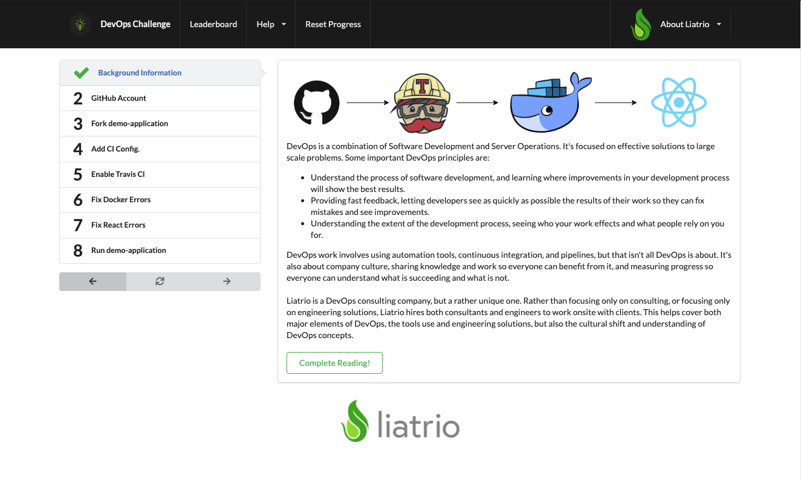

# Apprentice Outreach Instruction Application

---

This application is built to provide a standalone introduction to DevOps
aimed primarily at Chico State students. The goal of the full outreach
project is to cover basic DevOps concepts, Liatrio and the work we do,
Docker, and pipelines and CI tools.



Ultimately, this instruction application is tightly tied to the corresponding
[Demo App](https://github.com/liatrio/apprentice-outreach-demo-application).

Applicants are expected to find and resolve bugs in the provided demo
application while making use of tools like Docker and Travis CI.
This instruction application guides them through the process
and validates as they complete each step.

# Local Deveopment

---

## Method 1

This application is developed to be run using Docker-Compose. As such to run locally you will need to have *Docker* installed on your system. You will also need to have *yarn* installed locally for react ot pull dependencies.

Run:

```
docker-compose up
```

> Access on ``` http://localhost:3000/ ```

## Method 2

This application is developed to be run in Kubernetes. As such to run locally you will need to have *Docker* / *Kubernetes*, *Helm*, and *Skaffold* installed on your system. You will also need to have *yarn* installed locally for react to pull dependencies. 

Run:
```
skaffold dev --port-forward
```

> Access on ``` http://localhost:3000/ ```
